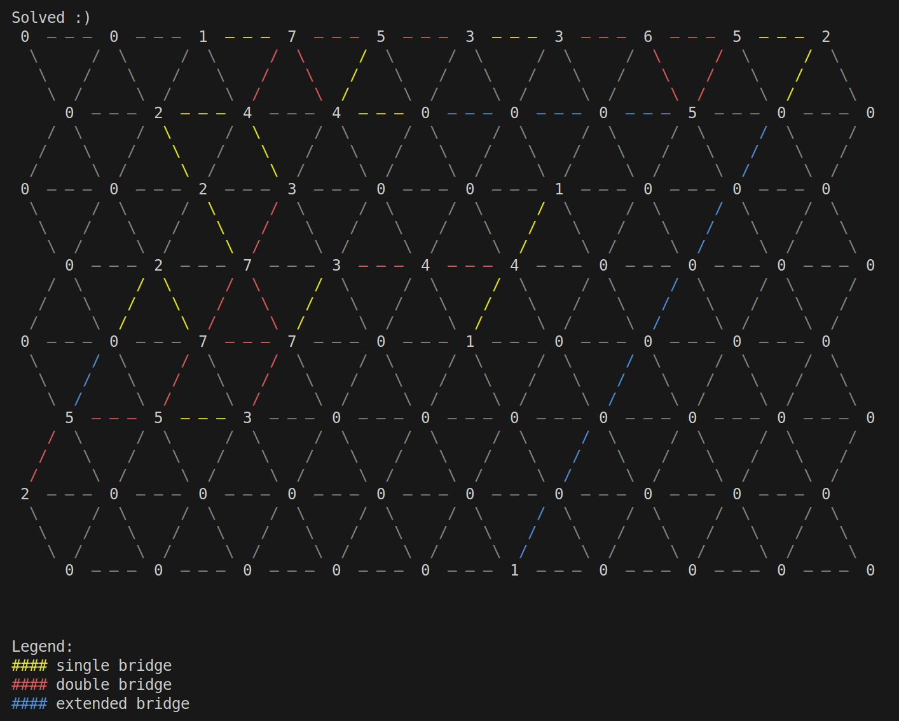

# Solve your hashiwokakero (work in progess)

## About
Hashiwokakero is a japanese puzzle that involves building bridges between islands. Either one, two or no bridges can be built between each island and built bridges must not cross each other. The puzzle is solved when all the islands are connected and there are exactly as many bridges connected to each island as required. In the original version of the puzzle, each island is surrounded by up to four neighboring islands. However, here we will look at a newer version in which each island is surrounded by up to six neighboring islands.
Check out [Zeit Online](https://spiele.zeit.de/hashiwokakero/) for detailed instructions and a large pool of puzzles.

## Solving a puzzle

First we need a puzzle that we want to solve. The following illustration shows an unsolved puzzle. Islands are outlined in orange, the connections and unused nodes are shown in gray. Each island indicates with how many bridges it must be connected at the end.


<p align="center">
    
</p>

Now that we have found a fresh, unsolved puzzle, the next step is to convert the weights of the islands into a matrix. To do this, we open the file Main.java and adapt the weight matrix of the main method according to the puzzle to be solved. It is important to note that every second row is indented half a position to the right. The first row is accordingly never indented, the last row may be indented or not. 
The weight matrix for the example puzzle looks like this:

```java
int [] [] weightMatrix = {
                {0,0,1,7,5,3,3,6,5,2},
                {0,2,4,4,0,0,0,5,0,0},
                {0,0,2,3,0,0,1,0,0,0},
                {0,2,7,3,4,4,0,0,0,0},
                {0,0,7,7,0,1,0,0,0,0},
                {5,5,3,0,0,0,0,0,0,0},
                {2,0,0,0,0,0,0,0,0,0},
                {0,0,0,0,0,1,0,0,0,0}
        };
```

To generate a new graph from the weight matrix and solve the puzzle, we add the following lines to the main method:

```java               
Graph graph = new Graph(weightMatrix);
graph.solveGraph();
```
And to plot the graph we add the following line to the main method:

```java
graph.plotGraph();
```

Now that we have completely adapted the main method to our example puzzle, we can start the program by running the main method. For our example puzzle we get the following output:

<p align="center">
        
</p>

We're lucky - the puzzle has been completely solved. Yellow edges indicate a single bridge connection, red edges indicate a double bridge connection and blue edges indicate a bridge connection that has been extended via unused nodes. 
Analogous to the unsolved puzzle, the following solution results for the output of our example puzzle:


<p align="center">
  
</p>

The numbers on the edges indicate whether a bridge connection is single or double. If we add up the outgoing bridge connections on each island, we get exactly their target value. So the puzzle has indeed been solved correctly.

## Outlook
Unfortunately, not all puzzles can be solved completely yet. As many puzzles have various possible solutions, the algorithm still needs to be extended to include ambiguous sub-problems. This challenge will be addressed in the near future.
But even now, the algorithm gives you a head start in solving a Hashiwokakero. Try it out for yourself!